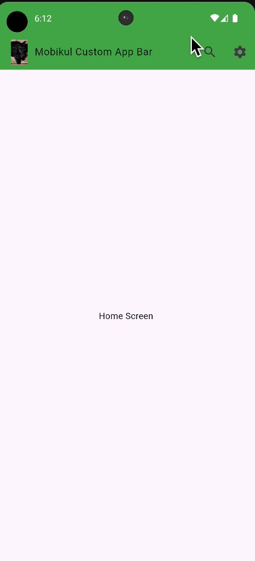

Mobikul Custom AppBar Flutter Package #

The MobikulCustomAppBar is a customizable Flutter widget that allows you to create app bars with a variety of configurations.
This package provides an easy way to implement app bars with custom titles, actions, and background colors.
It offers flexibility in setting the app bar's content, including icons, text, and buttons.
The widget allows you to adjust the appearance based on your app’s theme and style. With MobikulCustomAppBar, you can easily create a consistent and functional app bar across your app.

Features #

The MobikulCustomAppBar package provides a highly customizable AppBar widget for Flutter applications. Key features include:


- **Dynamic Heading and Style**
   Allows you to set a custom heading for the AppBar.
   Supports customizable text styles through the headingStyle parameter.
   Automatically adjusts the heading's style based on the provided or default TextStyle.
- **App Logo Support**
   Show App Logo: Includes a toggle (showAppLogo) to display or hide the app logo in the AppBar.
   Dark Mode Logo: Supports a separate app logo (darkAppLogoUrl) for dark mode scenarios, improving UI consistency in various themes.
   Custom Logo Sizes: Allows customization of logo width and height (logoWidth, logoHeight), ensuring proper scaling.
   Fallback Placeholder: Displays a placeholder image (placeHolderImage) if the logo fails to load.
- **Leading Button Options**
   Adds a leading button (e.g., back or clear) with the isLeadingEnable parameter.
   Supports custom callback actions through the onPressed parameter.
   Automatically handles navigation or custom actions based on the isLeadingEnable flag.
- **AppBar Appearance**
   Background Color: Allows customization of the AppBar background color (appBarBackgroundColor).
   Elevation Control: Enables or disables AppBar elevation with the isElevated parameter for a flat or elevated design.
- **Action Widgets**
   Supports additional action buttons (actions) to be added to the AppBar for extended functionality, such as search, settings, or notifications.
- **Home Navigation Support**
   Includes an optional home navigation feature (isHomeEnable) for ease of use in apps with hierarchical navigation.
- **Build Context Flexibility**
   Takes BuildContext as a parameter, ensuring seamless integration with the Flutter widget tree.
- **Optimized Visibility Logic**
   Efficiently manages the visibility of the app logo using the checkAppLogVisibility() method, ensuring unnecessary UI elements are not displayed.
- **Developer-Friendly Defaults**
    Provides reasonable default values for parameters like logoWidth, logoHeight, and appBarBackgroundColor.

## Installation
To add MobikulCustomAppBar to your project, include the following in your pubspec.yaml file:

```yaml
dependencies:
   mobikul_custom_app_bar: ^0.0.1  # Replace with the latest version
```

Then, fetch the package using the command:

```bash
flutter pub get
```

## Usage

### Here’s how to use the MobikulCustomAppBar in your Flutter app:


### Import the Package
```dart
import 'package:mobikul_custom_app_bar/mobikul_custom_app_bar.dart';
```

### Basic CustomAppBar Example
```dart
  Scaffold(
      appBar: MobikulCustomAppBar(
        "Mobikul Magento2 App Bar",
          context,
         Theme.of(context).textTheme.bodyLarge,
        isHomeEnable: true,
        isElevated:false,
        isAppLogoForDarkmode: true,
        appBarBackgroundColor: Colors.green,
        appLogoUrl: "https://fastly.picsum.photos/id/237/200/300.jpg?hmac=TmmQSbShHz9CdQm0NkEjx1Dyh_Y984R9LpNrpvH2D_U",
        logoHeight: 40,
        logoWidth: 40,
        actions: [
          IconButton(onPressed: (){
            Navigator.push(
              context,
              MaterialPageRoute(builder: (context) => SearchScreen()),
            );
            print("Search Screen");
          }, icon:  Icon(Icons.search),),

          IconButton(onPressed: (){
            Navigator.push(
              context,
              MaterialPageRoute(builder: (context) => SettingScreen()),
            );
            print("Settings Screen");
          }, icon:  Icon(Icons.settings),),

        ],
        showAppLogo: true,
      )
  );
  ```

## Properties

| Property             | Type             | Default                    | Description                                                                 |
|----------------------|------------------|----------------------------|-----------------------------------------------------------------------------|
| `heading`              | `String`         | `Required`                       | The title text displayed in the AppBar.                                    |
| `headingStyle`           | `TextStyle?`     | `Theme.of(context).textTheme.bodyLarge`                   | Defines the style of the title text.                                     |
| `showAppLogo`               | `bool`           | `Required`                    | Whether to display the app logo in the AppBar.                              |
| `context` | `BuildContext`   | `Required`         | The current BuildContext, required for navigation and theme access.                                      |
| `isElevated`     | `bool`           | `true`                    | Adds elevation (shadow) to the AppBar when true.                                        |
| `isLeadingEnable`   | `bool`           | `false`                     | Enables the leading button (typically a back button).                                      |
| `isHomeEnable`    | `bool`           | `false`                     | Displays a home icon or logo when true.                              |
| `isAppLogoForDarkmode` | `bool?`          | `false`                     | Uses the dark mode version of the logo when true and the app is in dark mode.|
| `actions`    | `List<Widget>?`  | `null`                     | A list of action widgets (e.g., buttons) displayed on the right side of the AppBar.                             |
| `onPressed`    | `VoidCallback?	` | `null`                     | Callback function triggered when the leading button is pressed.	                             |
| `appLogoUrl`    | `String?`        | `null`                     | URL for the app logo displayed in light mode.                      |
| `darkAppLogoUrl`    | `String?`        | `null`                     | URL for the app logo displayed in dark mode.                   |
| `placeHolderImage`    | `String?`        | `null`                     | Local placeholder image path used when the app logo URL fails to load.                     |
| `appBarBackgroundColor`    | `Color?`        | `Colors.white`                     | Background color of the AppBar.                    |
| `logoWidth`    | `double?`        | `30.0`                     | Width of the app logo in pixels.                    |
| `logoHeight`    | `double?`        | `30.0`                     | Height of the app logo in pixels.               |

## Output

Here’s an example of the `MobikulCustomAppBar` in action:




